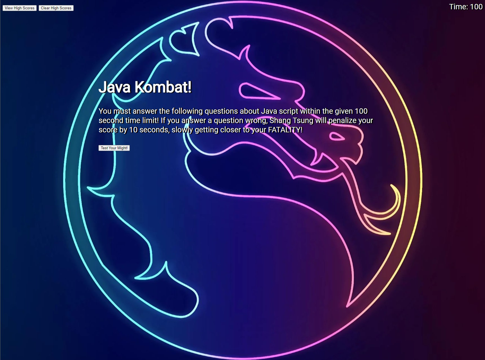

# Module 04 Challenge

## Mock Up



This is my completed code for the Module 04 challenge this week. We were given a task this week to make our own HTML, CSS, and Javascript code to create our own multiple choice quiz, along with other requirements.

## User Story

```
AS A coding boot camp student
I WANT to take a timed quiz on JavaScript fundamentals that stores high scores
SO THAT I can gauge my progress compared to my peers
```

The Acceptance Criteria is as follows:

## Acceptance Criteria

```
GIVEN I am taking a code quiz
WHEN I click the start button
THEN a timer starts and I am presented with a question
WHEN I answer a question
THEN I am presented with another question
WHEN I answer a question incorrectly
THEN time is subtracted from the clock
WHEN all questions are answered or the timer reaches 0
THEN the game is over
WHEN the game is over
THEN I can save my initials and my score
```

What I did to complete this challenge is take each individual criteria one at a time, while also trying to minimize repetativeness in the code. I first started creating my HTML file with elements I knew I wanted on the homepage. This was pretty simple, as all I needed on the page was a high score button, clear high score button, timer, title, description, and start button.

I then went to work directly on the Javascript file, as this would take up most of my time. The main focus of this activity in my opinion is the functionalty, so I did not give much thought on the asthetics at this point. I started with declaring all my variables. I started with declaring my first variable as questions, choices, and answers in an array. I then assigned variables to all my sections in the HTML to the proper area. I then declared variables for the time, penalty, and one to create a unordered list for my question choices. 

I went on to add an event listener to start the time when the start button is clicked. This is also where I added an if statement where text will come up once the time goes to 0. Next, just to get the button out of the way, I also added an event listener to my clear high score button to clear local storage once clicked. This was relatively easy, as the only code for this was to ```localStorage.clear ()```. I then went on to write my function to give/generate the questions, another function to compare (find out weather or not the selected answer is correct), and another function for when the quiz is completed. More details of the flow of the code is commented in the Javascript file. 

Once I was finished with the Javascript code, I was then ready to add style to my quiz page. I just positioned my buttons, timer, and main content accordingly, and added a wallpaper/theme to the quiz. I also changed the font using google fonts, and added a slight shadow effect to the text to make it pop infront of the background.


## Please see attached links to Repository and Deployed Page:
https://github.com/jdanleano/Java-Kombat
https://jdanleano.github.io/Java-Kombat/
